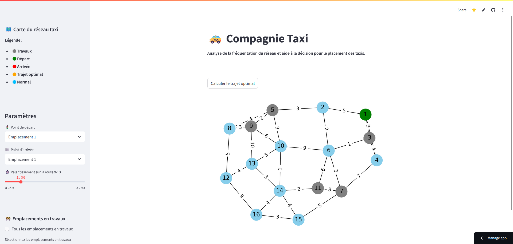

# 🚕 Compagnie Taxi

Ce projet propose une simulation interactive du réseau d'une compagnie de taxis dans une ville.  
Il permet d'analyser la fréquentation des différents emplacements et d'aider à la prise de décision pour le placement optimal des taxis.

## Table des matières

- [🚕 Compagnie Taxi](#-compagnie-taxi)
  - [Table des matières](#table-des-matières)
  - [Fonctionnalités](#fonctionnalités)
  - [Installation rapide](#installation-rapide)
  - [Prérequis](#prérequis)
  - [Tests](#tests)
  - [Utilisation](#utilisation)
    - [Lancer le serveur Streamlit](#lancer-le-serveur-streamlit)
    - [Structure du projet](#structure-du-projet)
    - [Interface utilisateur](#interface-utilisateur)
  - [Contribuer](#contribuer)
  - [Auteurs](#auteurs)

## Fonctionnalités

- **Visualisation du réseau** : Affichage graphique des emplacements et des routes de la ville.
- **Simulation de travaux** : Possibilité de marquer des emplacements comme étant en travaux.
- **Ralentissements dynamiques** : Application de ralentissements sur certaines routes.
- **Calcul de trajet optimal** : Recherche du chemin le plus rapide entre deux emplacements.
- **Analyse de la fréquentation** : Calcul des emplacements les plus fréquentés selon les paramètres.
- **Interface interactive** : Utilisation de Streamlit pour une expérience utilisateur fluide.

## Installation rapide

Clonez le dépôt et installez les dépendances :

```bash
git clone https://github.com/Dumont-Roty/compagnie-taxi.git
cd compagnie-taxi
pip install -r requirements.txt
```

## Prérequis

- Python 3.8+ : Assurez-vous d'avoir Python installé sur votre machine.
- [Streamlit](https://streamlit.io/)
- [NetworkX](https://networkx.org/)
- [matplotlib](https://matplotlib.org/)

## Tests

Des tests unitaires sont présents dans le dossier `tests/` et couvrent les principales fonctionnalités du projet (création de la ville, cohérence des routes, analyse de fréquentation, etc.).

Pour lancer les tests :

```bash
PYTHONPATH=src pytest
```

## Utilisation

### Lancer le serveur Streamlit

Pour démarrer l'application, exécutez la commande suivante dans le terminal à la racine du projet :

```bash
streamlit run st_aff.py
```

### Structure du projet

Le projet est structuré comme suit :

```text
compagnie-taxi/
├── st_aff.py                  # Point d'entrée Streamlit
├── src/
│   └── compagnie_taxi/
│       ├── affichage.py           # Fonctions d'affichage du graphe
│       ├── analyse_frequentation.py # Analyse de la fréquentation
│       ├── reseau_taxi.py         # Modélisation du réseau et des emplacements
│       ├── ville.py               # Initialisation de la ville
│       └── utils.py               # Fonctions utilitaires (optionnel)
├── tests/
│   ├── test_analyse_frequentation.py # Tests sur l'analyse de fréquentation
│   ├── test_reseau_taxi.py           # Tests sur la modélisation du réseau
│   └── test_ville.py                 # Tests sur la ville et les emplacements
├── requirements.txt
└── README.md
```

### Interface utilisateur



- **Visualiser le réseau** : Ouvrez l'application et explorez la carte de la ville.
- **Marquer un emplacement en travaux** : Cliquez sur un emplacement et sélectionnez l'option "En travaux".
- **Appliquer un ralentissement** : Sélectionnez une route et définissez un ralentissement.
- **Calculer un trajet** : Choisissez deux emplacements et cliquez sur "Calculer le trajet".
- **Analyser la fréquentation** : Sélectionnez les paramètres d'analyse et visualisez les résultats.

## Contribuer

Si vous souhaitez contribuer au projet, n'hésitez pas à soumettre des issues ou des pull requests. Toute contribution est la bienvenue !

## Auteurs

- **DUMONT ROTY Pierre** - *Etudiant Master MECEN* - [Votre Profil GitHub](https://github.com/Dumont-Roty)
- **MELLOT Rachel** - *Etudiant Master MECEN* - [Votre Profil GitHub](https://github.com/RachelMellot)
